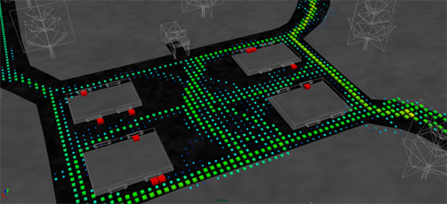
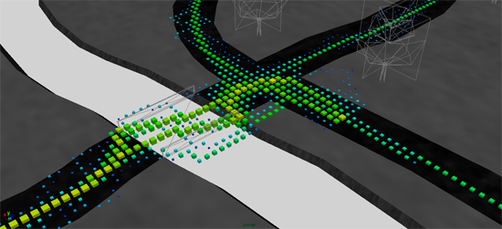
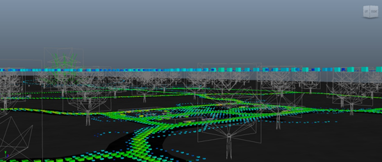

# 3D Heat Map

Many different techniques can analyze user game testing data, each with its own strongpoints and drawbacks. One of these techniques is to build a heat map visualization that is quick and easy to read. However, this technique has the drawback that the heat maps only generate into a 2D image that removes one dimension of space. This research demonstrates how to generate a 3D scene for a heat map in Maya 2010 that removes this drawback.

Through this research, I determined that a successful 3D heat map can be generated using Maya as the scene viewer. A potential drawback to using a 3D heat map is the issue of perception and where a point truly lies if it is not adjacent to another mesh, which is demonstrated in image below. It is possible to address this issue with Maya by selecting that point, focusing the camera on it and then rotating around that point to determine its position. This drawback may be the reason there is no current documentation of this type of heat being used in the game industry. A definite conclusion as to the reason for a lack of documentation cannot be proven at this time as the above mentioned ideas into the causes are merely speculation and would require further research into the area to discover why 3D heat maps are not currently in use.

For further information on this research topic please download the full version of the research document [here](../assets/doc/3d-heat-map.pdf).
